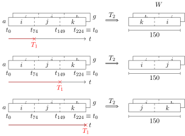
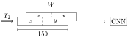

## Data structures

The main data structures are the following `float` arrays, defined in the `data.c` file:

- `accel_data`, which is an array of size  and stores the values sampled from the accelerometer;
- `gyro_data`, which is an array of size  and stores the values sampled from the gyroscope;
- `model_input`, which is an array of size  and implements the sliding window structure. Every element of this array has the following structure:

   ```
   model_input[i] = {a_x, a_y, a_z, g_x, g_y, g_z};
   ```
   
   where `a_x, a_y, a_z` are the accelerometer values sampled at a specific time $t$ and `g_x, g_y, g_z` are the gyroscope values sampled at the same time $t$.

## Threads

## Workflow

<p align="center">
  
</p>
<p align="center">
  
</p>